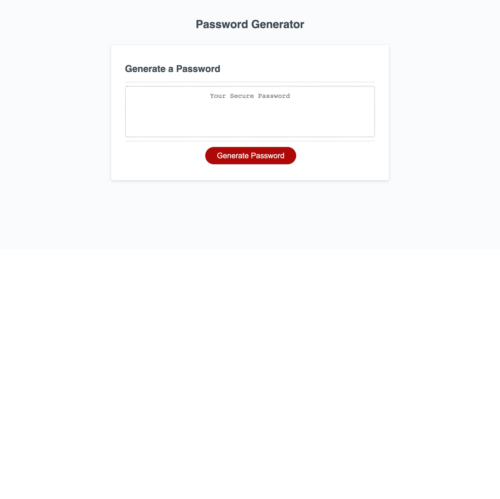

# sarahs-password-generator

Website Live URL: https://sarahgormley.github.io/sarahs-password-generator/
  
Screenshot of Site: )

This Password Generator was created as a way for me to showcase my skills as a software developer, using Javascript to manipulate a webpage into showing a series of prompts to determine the length of a password, and the type of characters the user wants in their password. 

Once all these conditions are met, a secure, random password is shown. 

To accomplish this, I used variables, functions, if/else statements, for loops, and event listeners so the page is responsive to user clicks. 

By completing this project, I was able to consolidate my skills using Javascript and understand the functionality behind each rule, and visualise how their execution can change a webpage. I viewed multiple different password generators, and was able to understand how there are multiple ways to get the same result. I used the methods I did in this Password generator as I feel that it is clean code, and it is easy to manage. Overall, I have gained a better understanding of the importance and usefullness of Javascript, and am excited to continue incorporating it into my daily work. 

Within this ReadMe you will find: 
- Links to the live webpage of my Password Generator site
- Screenshots of the webpage
- HTML, CSS, and Javascript coding associated with the page
- This README 
